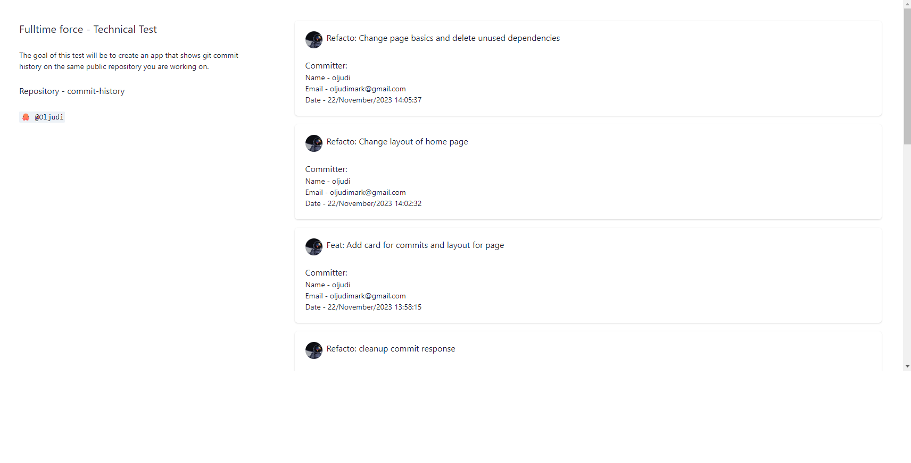

# Commit history

**The goal of this test its to create an app that shows git commit history of this repository.**

## Build with

#### Frontend
- [Vite](https://vitejs.dev/guide/why.html) - a build tool that aims to provide a faster and leaner development experience for modern web projects.
    - [React](https://es.react.dev/) with [Typescript](https://www.typescriptlang.org/)
- [ChakraUI](https://chakra-ui.com/) - a simple, modular and accessible component library that gives you the building blocks you need to build your React applications.

#### Backend
- [NodeJS](https://nodejs.org/en/about)
- [NestJS](https://docs.nestjs.com/) - a framework for building efficient, scalable Node.js server-side applications.

## Requirements
This project need NodeJs 14+ to run
To install [node](https://nodejs.org/en/about) you can use [nvm](https://github.com/nvm-sh/nvm): 
```bash
nvm install node
```

## List of Environmentals Variables
### Frontend
- VITE_SERVER_URL: The connection to backend server
```plaintext
VITE_SERVER_URL=http://localhost:3000
```
### Backend
- GITHUB_TOKEN: The github api key required for authentication, provided via email
```plaintext
GITHUB_TOKEN=github_pat_secret
```
- GITHUB_OWNER: The repository owner of the project
```plaintext
GITHUB_OWNER=oljudi
```
GITHUB_REPO: The repository name
```plaintext
GITHUB_REPO=commit-history
```

## Installation

#### Frontend
- Move to frontend directory
```bash
cd frontend
```
- For local development, you can use a .env file in the root of the project. Create a file named .env and add your variables with values.
```bash
touch .env
```
- Use npm to install dependencies
```bash
npm install
```
- Once dependencies are installed, run frontend project using
```bash
npm run dev
```
- Once script completes, project should start running on local environment

#### Backend
- Move to backend directory
```bash
cd backend
```
- For local development, you can use a .env file in the root of the project. Create a file named .env and add your variables with values.
```bash
touch .env
```
- Use npm to install dependencies
```bash
npm install
```
- Once dependencies are installed, run backend project using
```bash
npm run start:dev  
```
- Once script completes, project should start running on local environment

## Operation

Once both backend and frontend projects are running on your local environment, open a new tab of your web navigator and go to the frontend project usually located on port 5173
```bash
http://localhost:5173/
```



Here you can see a list of commits from this project

